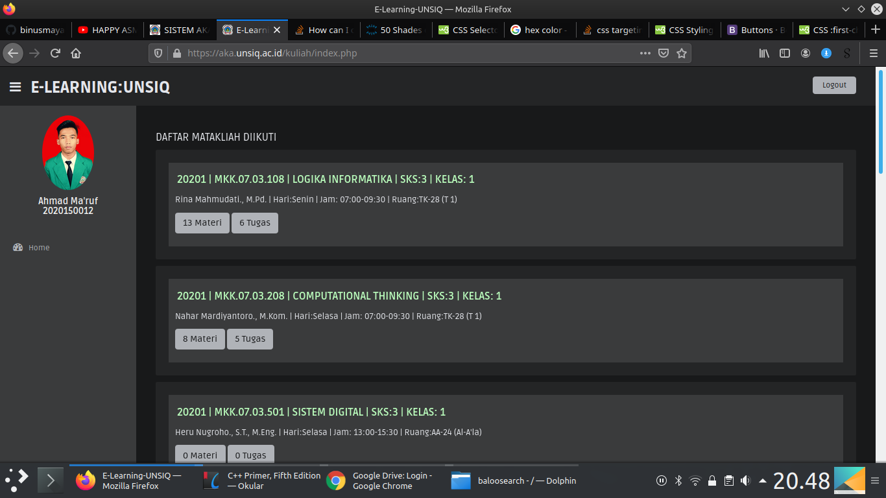
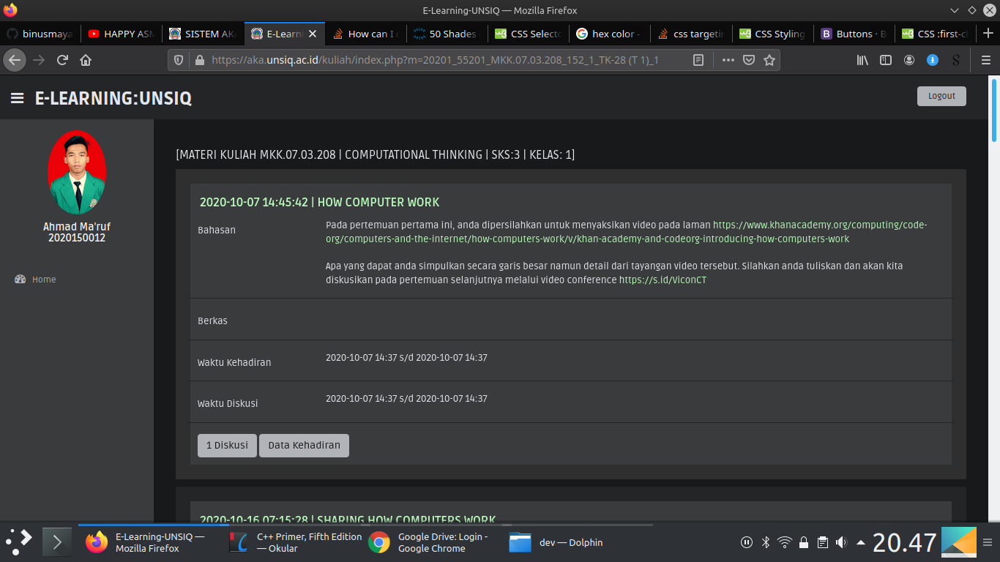
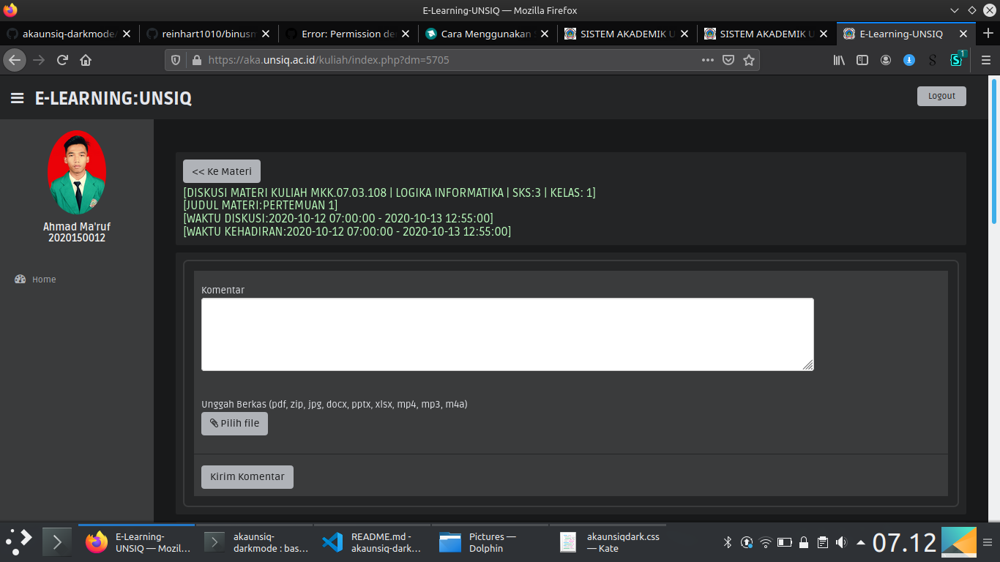

# Dark Mode untuk E-Learning UNSIQ

> project ini terinspirasi oleh [repository ini](https://github.com/reinhart1010/binusmaya-dark-mode)  

> Saat ini project ini hanya mengubah dark-mode untuk web e-learning unsiq https://aka.unsiq.ac.id/kuliah/  
> `(*hanya prefix /kuliah/)`  

## Screenshoot
  

  

  

## Cara Instalasi
1. Install [Stylus](https://add0n.com/stylus.html) plugin/addon (untuk [Chrome](https://chrome.google.com/webstore/detail/stylus/clngdbkpkpeebahjckkjfobafhncgmne) | [Firefox](https://addons.mozilla.org/firefox/addon/styl-us/) | [Opera](https://addons.opera.com/extensions/details/stylus/))

2. Akses [E-Learning UNSIQ](https://aka.unsiq.ac.id/), kemudian klik menu **kuliah**
3. Klik ikon _stylus_ pada toolbar dan tambah pengaturan baru (_add new rules_) untuk *https://aka.unsiq.ac.id/kuliah/*
4. Copy and paste isi dari file **main.css**
5. klik **Save** (atau `Ctrl + S`) untuk menyimpan dan menjalankan aturan css tersebut.

## Compatibility
This userstyle is compatible with all major browsers (specifically, supporting the [CSS `filter` property](https://developer.mozilla.org/en-US/docs/Web/CSS/filter))

## Lisensi
[MIT License](https://github.com/ahmaruff/akaunsiq-darkmode/blob/main/LICENSE)

Project ini tidak dibuat maupun disponsori oleh [UNSIQ](http://unsiq.ac.id)